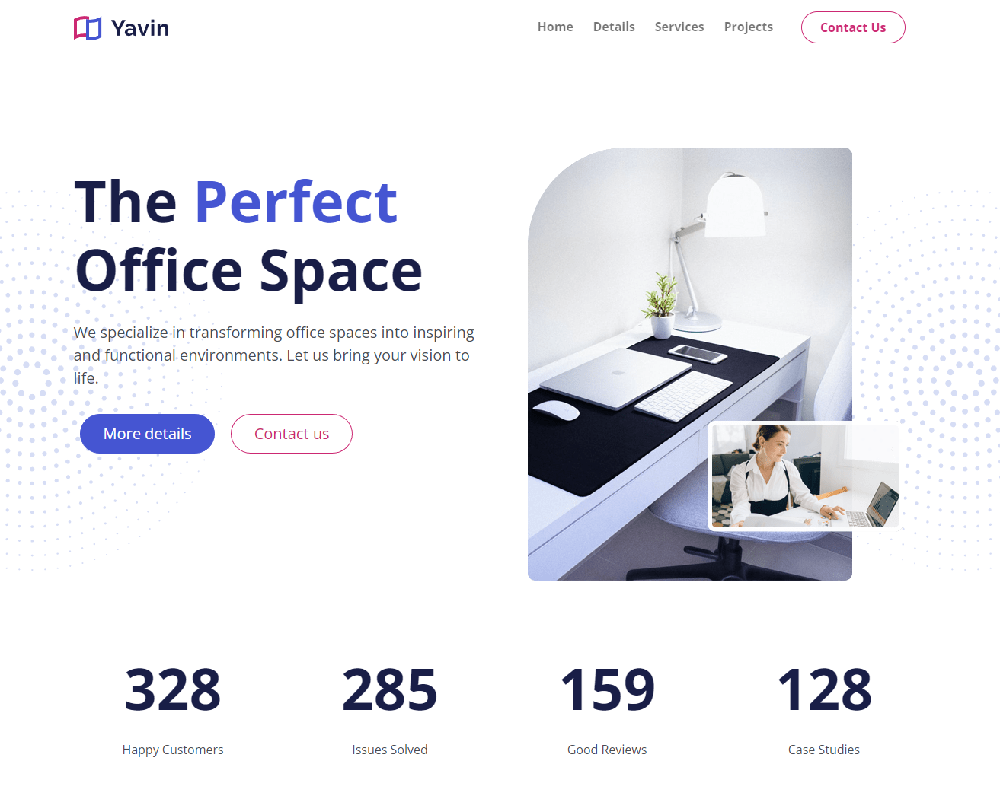
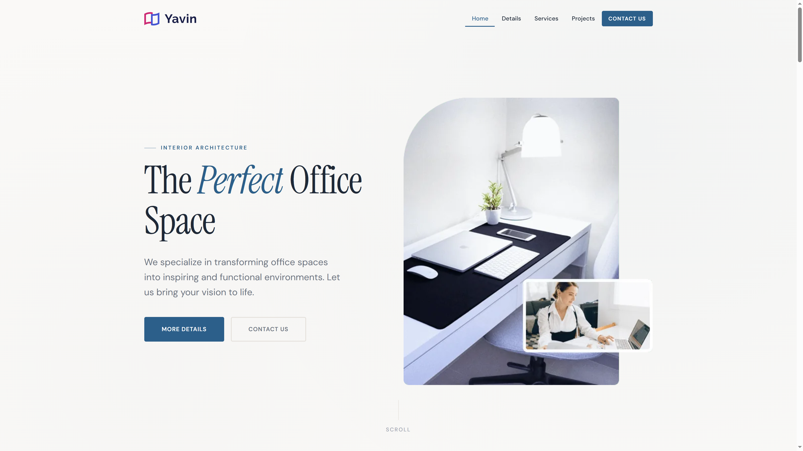
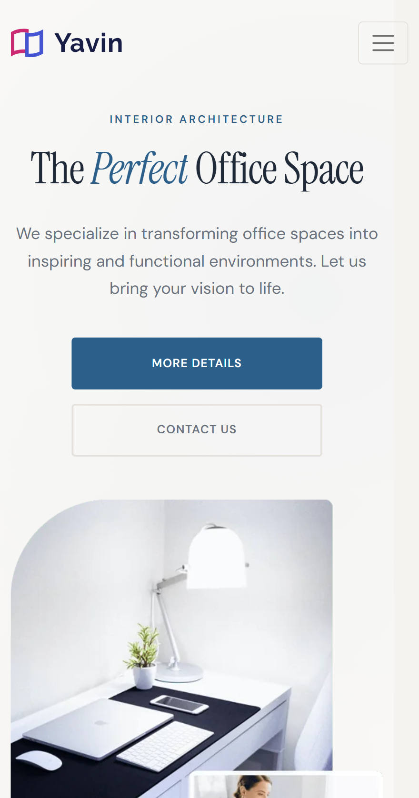
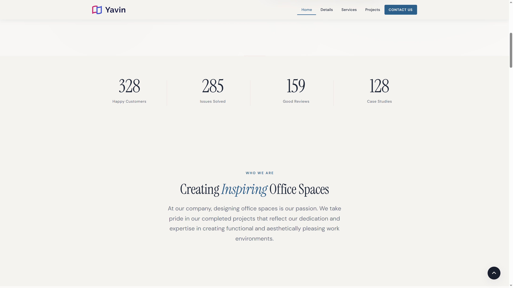
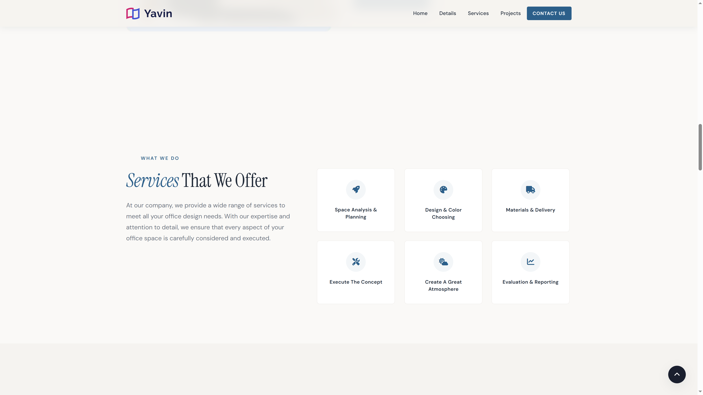
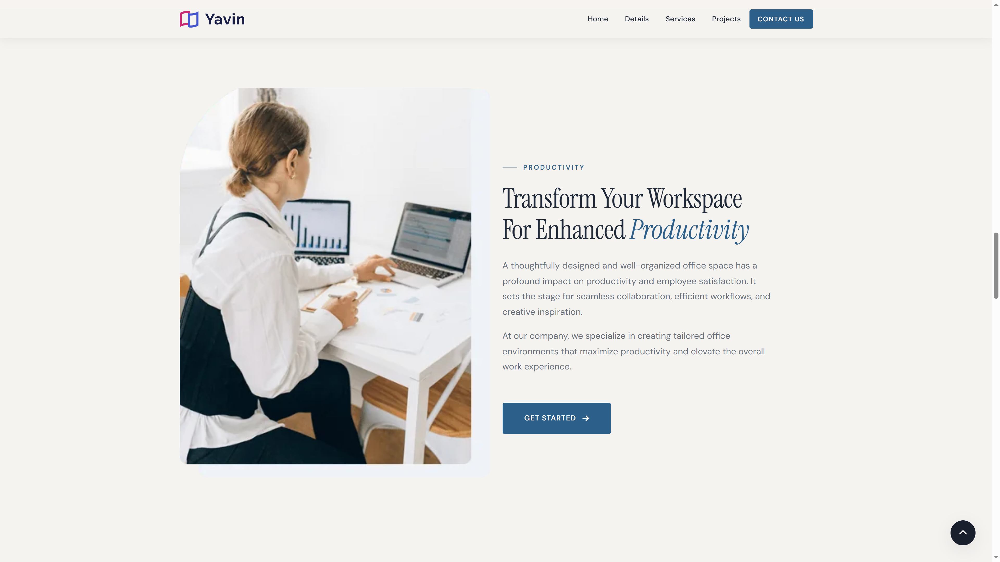
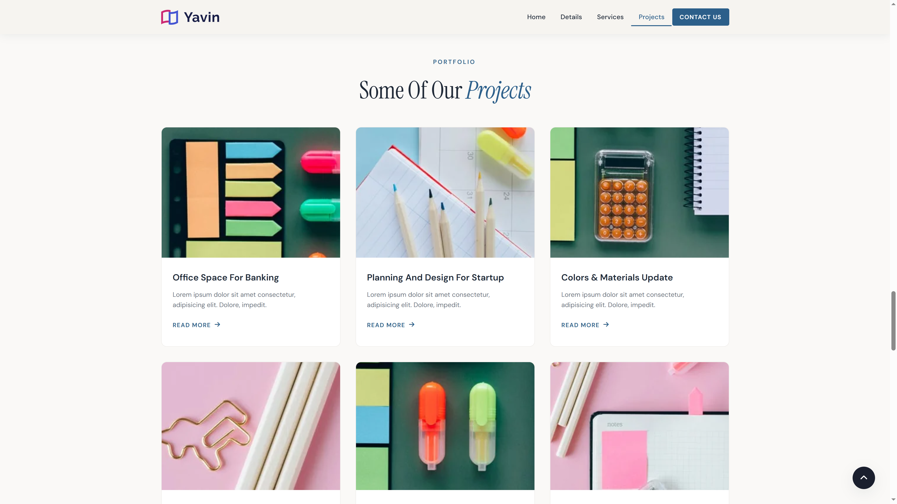
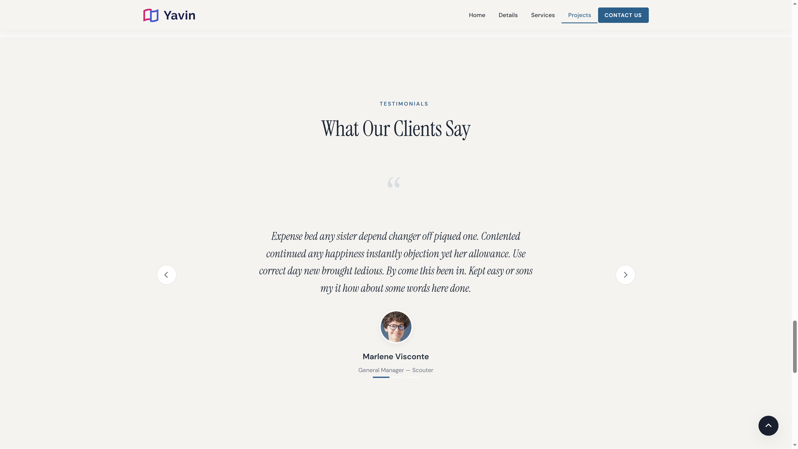
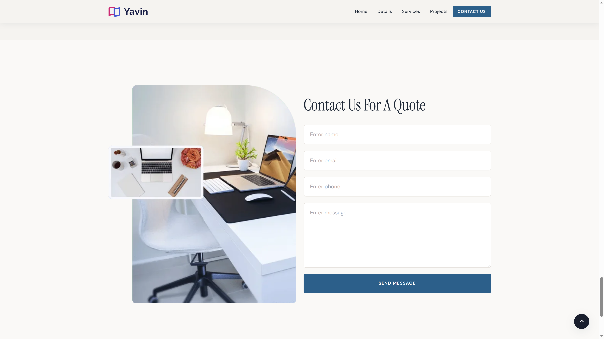
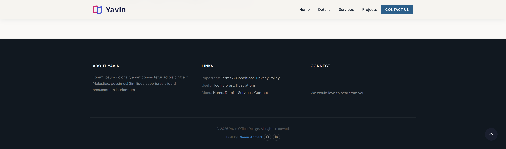

# Yavin - Office Design Landing Page

A responsive, motion-rich landing page for an office interior design studio. Built with semantic HTML5, CSS3, JavaScript, and Bootstrap 5, with a hand-written GSAP + ScrollTrigger animation system that degrades gracefully without requiring any build or compilation step.

> **[Live Demo](https://samirahmed00.github.io/Yavin-Office-Design-Landing-Page/)**



## Overview

Yavin is a modern office interior design website focused on transforming workspaces into functional, inspiring, and visually refined environments.

The website combines large-scale architectural imagery, structured content, service presentation, project showcases, testimonials, statistics, and a dedicated contact experience into a complete business landing page.

The project is designed around a simple idea:

> Creating inspiring office spaces that balance functionality, aesthetics, and productivity.

The landing page guides visitors through the company's identity, services, design approach, selected projects, client feedback, and contact experience.

The visual direction focuses on strong photography, clear typography, generous spacing, and a professional editorial-style presentation.

## Features

* **Two pages** - A full marketing homepage (`index.html`) and an inner article page (`article.html`) sharing the same navbar, footer, and design system.
* **Diversified GSAP scroll animations** - Each section has its own animation treatment, including word-by-word title reveals, clip-path image reveals, staggered grids, alternating directional cards, and a count-up statistics section.
* **Resilient by design** - Content is visible by default. JavaScript only hides an element immediately before animating it, preventing failed or slow scripts from leaving the page blank.
* **Reduced motion support** - `prefers-reduced-motion` is respected throughout the animation system. Animations are skipped and statistics are set to their final values immediately.
* **No-JavaScript fallback** - A `<noscript>` fallback keeps the page content visible when JavaScript is disabled.
* **Sticky navigation** - Scroll-aware navbar background, active-link highlighting, and smooth anchor navigation.
* **Bootstrap 5 components** - Responsive mobile menu, testimonial carousel, and form components.
* **Font Awesome icons** - Self-hosted webfonts with no external Font Awesome font CDN dependency.
* **Interactive statistics** - Animated count-up statistics.
* **Back-to-top button** - Quick navigation back to the top of the page.
* **Contact form** - Structured quote request experience.
* **Optimized imagery** - Content images are served as WebP where applicable.

## Website Sections

### Hero

Introduces Yavin and its approach to transforming office spaces into inspiring and functional environments.

The hero combines a strong headline, supporting copy, navigation call-to-action, and a large office interior image.

### About

Introduces the company and its approach to office design.

The section focuses on creating workspaces that are:

* Functional
* Aesthetically pleasing
* Tailored to each client
* Aligned with brand identity and company culture

### Services

Presents the main services offered by Yavin:

* Space Analysis & Planning
* Design & Color Choosing
* Materials & Delivery
* Execute The Concept
* Create A Great Atmosphere
* Evaluation & Reporting

### Productivity

Explores the relationship between workspace design, productivity, employee satisfaction, collaboration, and creative inspiration.

The section combines editorial content with supporting workspace imagery.

### Portfolio

Showcases selected office design projects across different categories:

* Office Space For Banking
* Planning And Design For Startup
* Colors & Materials Update
* Analysis And Floor Design
* Office Space Decoration
* Playground For Kindergarten

Each project is presented through an image, project title, supporting description, and project link.

### Testimonials

Provides social proof through client feedback and professional attribution.

### Contact

Provides a dedicated contact experience for visitors interested in requesting a quote.

The section includes fields for:

* Name
* Email
* Phone
* Message

### Footer

The footer provides company information, useful links, navigation, and additional resources.

## Design & UX

The interface follows a visual and editorial approach suitable for an interior architecture and office design brand.

Key design principles include:

* Strong visual hierarchy
* Large architectural photography
* Generous whitespace
* Clear typography
* Minimal navigation
* Structured content sections
* Image-driven storytelling
* Consistent spacing
* Clear calls to action
* Professional business presentation

The goal was to create a website that feels like a real interior design company's digital presence rather than a generic landing page.

## Responsive Design

The website is designed to adapt across desktop, tablet, and mobile screen sizes.

Responsive considerations include:

* Flexible navigation
* Responsive image layouts
* Adaptive typography
* Portfolio grid restructuring
* Flexible content sections
* Mobile-friendly spacing
* Responsive contact form
* Preserved visual hierarchy across screen sizes

## Animation System

The website uses a hand-written animation system built with GSAP and ScrollTrigger.

Rather than applying the same reveal animation to every section, the animation system uses different treatments based on the content and layout.

Examples include:

* Hero timeline animations
* Word-by-word heading reveals
* Clip-path image reveals
* Staggered project and service grids
* Directional card animations
* Count-up statistics
* Scroll-triggered content reveals

Each major section has its own initialization logic, allowing animations to remain isolated and maintainable.

The animation system also respects `prefers-reduced-motion` and provides graceful fallbacks when JavaScript or external animation libraries are unavailable.

## Resilient Animation Architecture

A key implementation goal was to ensure that animation never becomes a dependency for accessing the content.

Content remains visible by default, and JavaScript only prepares elements immediately before their animation begins.

This prevents a common animation failure where a CDN or JavaScript error leaves sections permanently hidden.

The project also includes a `<noscript>` fallback for users who disable JavaScript entirely.

## Tech Stack

| Category   | Technology                 |
| ---------- | -------------------------- |
| Markup     | Semantic HTML5             |
| Layout     | Bootstrap 5                |
| Styling    | CSS3                       |
| Animation  | GSAP 3 + ScrollTrigger     |
| Icons      | Font Awesome               |
| Fonts      | Instrument Serif + DM Sans |
| JavaScript | Vanilla JavaScript         |
| Build Step | None                       |

Bootstrap provides the responsive grid and selected UI components, while the custom CSS and JavaScript handle the project's visual system and interactions.

GSAP and ScrollTrigger are loaded from cdnjs.

Font Awesome webfonts are self-hosted inside the project.

## Project Structure

```text
yavin/
├── index.html                  # Homepage
├── article.html                # Inner article / project detail page
├── css/
│   ├── bootstrap.css           # Bootstrap 5
│   ├── font-awesome.css        # Font Awesome
│   └── styles.css              # Design tokens + custom styles
├── js/
│   ├── bootstrap.bundle.min.js # Bootstrap JavaScript
│   └── script.js               # Custom GSAP animation system
├── images/                     # Website images and branding assets
└── webfonts/                   # Font Awesome font files
```

## Running Locally

No build step or package installation is required.

Any static file server can be used to run the project locally.

### Python

```bash
python3 -m http.server 8000
```

Then open:

```text
http://localhost:8000
```

### Node.js

```bash
npx serve .
```

Opening `index.html` directly through `file://` also works for a quick preview, but using a local server is recommended.

## Customizing

### Design Tokens

Colors, typography, spacing, and other design values are defined as CSS custom properties at the top of:

```text
css/styles.css
```

Updating a token allows the visual system to be changed consistently across the website.

### Animations

The animation system is organized inside:

```text
js/script.js
```

Animation initialization is separated by section, making individual sections easier to add, remove, or reorder without affecting unrelated animation logic.

The implementation also guards against missing sections so that animations fail gracefully when a section is not present.

### Script Loading

GSAP, ScrollTrigger, and the custom `script.js` are loaded at the end of `<body>` in the required order.

The animation script depends on GSAP and ScrollTrigger being available on `window` before it executes.

## Performance

* Content images are served as **WebP** where applicable.
* `favicon.png` remains PNG for broad favicon compatibility.
* `logo.svg` remains SVG as a lightweight vector asset.
* Below-the-fold images use lazy loading where appropriate.
* No build tooling or dependency installation is required.

## Accessibility

Accessibility considerations include:

* Semantic HTML landmarks
* Accessible navigation
* `aria-label` and `aria-labelledby` attributes where appropriate
* Visually hidden form labels
* Keyboard-friendly carousel controls
* Keyboard-friendly back-to-top control
* `prefers-reduced-motion` support
* No-JavaScript fallback
* Content remaining accessible without animation

## Browser Support

The project targets modern evergreen browsers:

* Chrome
* Firefox
* Safari
* Edge

The animation system and visual effects are designed to degrade gracefully on environments where JavaScript, animation libraries, or newer CSS features are unavailable.

## Screenshots

### Hero



### Responsive Hero



### About



### Services



### Productivity



### Projects



### Testimonials



### Contact



### Footer



## Project Goals

This project was built to practice creating a complete business landing page with a strong focus on:

* Visual storytelling
* Responsive web design
* Image-driven interfaces
* Information architecture
* Business-oriented content presentation
* Portfolio presentation
* Service communication
* Professional UI composition
* Motion design
* Graceful animation fallbacks
* Accessibility

## Live Demo

**[View Yavin Live Demo →](https://samirahmed00.github.io/Yavin-Office-Design-Landing-Page/)**

## Author

**Samir Ahmed** - Full Stack Developer

[GitHub](https://github.com/SamirAhmed00) · [LinkedIn](https://www.linkedin.com/in/samir-ahmed00/)
